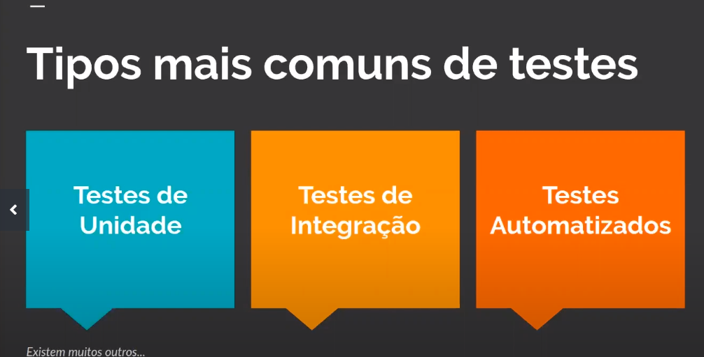
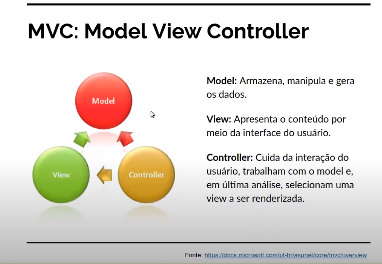
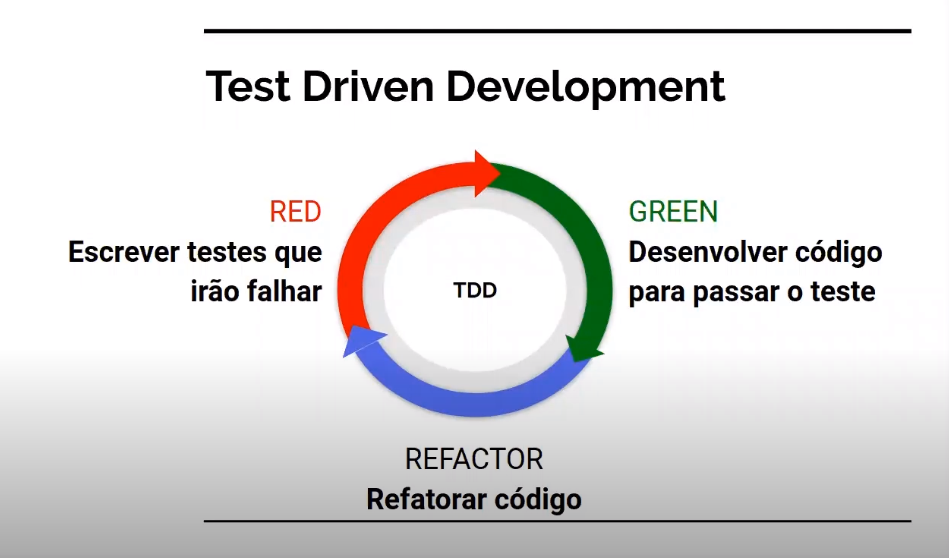

# dotnet-vaquinha-tests

Este projeto é requisito para completar o bootcamp Avanade Fullstack Developer e contempla testes usando o xUnit para realizar testes de unidade em C#. O projeto é um projeto baseado em vaquinhas (crowfunding) online. 
Contempla : 
padrão de desenvolviemnto MVC 
TDD 
XUnit
Theory e InlineData

Teste unitário : 

- teste caixa branca : conhece o codigo 
- teste caixa preta : não conhece o codigo 
- regressão : novas versões não afetam versões passadas 
- focar os testes nas funcionalidades mais usadas 
 
 
- XUnit 
- AAA - Arrange , Act , Assert 
- mocks != fake 
- mock dado simulado 
- fake = faz realmente o request 
- 

## Digital Innovation One

[Clique aqui para se inscrever na Digital Innovation One](https://digitalinnovation.one/sign-up?ref=H395IYS4Z6)  

## Eliézer Zarpelão
[GitHub Timeline](https://elizarp.github.io/timeline/)  
[Linkedin](http://br.linkedin.com/in/eliezerzarpelao)  
[Github](https://github.com/elizarp) 

## Marcos Freire
[Linkedin](https://www.linkedin.com/in/marcos-freire-a73891125/)  
[Github](https://github.com/marcosfreire) 

## Slides
[Slides em PDF](TesteNetCore.pdf)